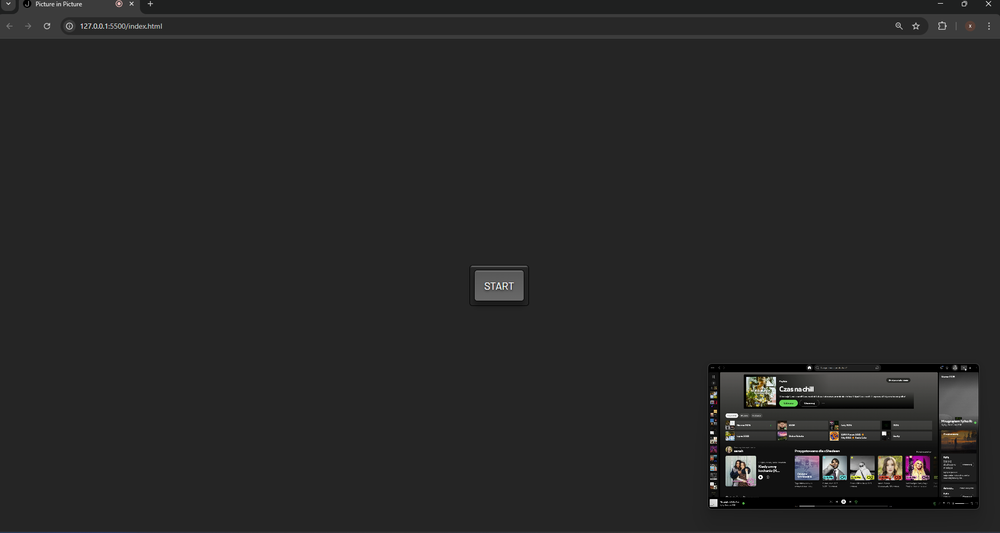

# Picture-in-Picture (PiP) Viewer 🖥️➡️📺

  

A lightweight JavaScript implementation for viewing any screen/window in Picture-in-Picture mode.

## Key Features ✨

- **Screen Sharing** - Select any application window or entire screen to display
- **One-Click PiP** - Toggle always-on-top mode with a single button
- **Cross-Browser Support** - Gracefully checks for API availability
- **Automatic Cleanup** - Stops previous streams before loading new ones
- **Intuitive UI** - Visual button states during operations

## Tech Stack 🛠️

- 
- 
- 
- 

## Installation 💻

1. Clone the repository:
```bash
git clone https://github.com/xShadeen/PictureInPicture.git
cd PictureInPicture
```
2. Simply open index.html in a modern browser (WebRTC support required).
## Usage🖱️
- Select a window/screen to display
- Share your window/screen
- Click "START" to enter Picture-in-Picture mode
- Close the PiP window to exit

The system automatically:
- Verifies PiP API availability
- Manages button states during operations
- Cleans up previous media streams
- Handles and logs errors to console

## Browser Support 🌐

| Browser       | PiP Support | Minimum Version | Notes                  |
|--------------|-------------|-----------------|------------------------|
| Chrome       | ✅ Yes      | 71+             | Full support           |
| Edge         | ✅ Yes      | 79+             | Chromium-based         |
| Firefox      | ✅ Yes      | 69+             |                        |
| Safari       | ⚠️ Partial  | 13+             | Limited functionality  |
| Opera        | ✅ Yes      | 60+             | Chromium-based         |

## API Documentation ℹ️
This project utilizes:
- getDisplayMedia() - Screen selection
- requestPictureInPicture() - PiP activation
- pictureInPictureEnabled - Feature detection
